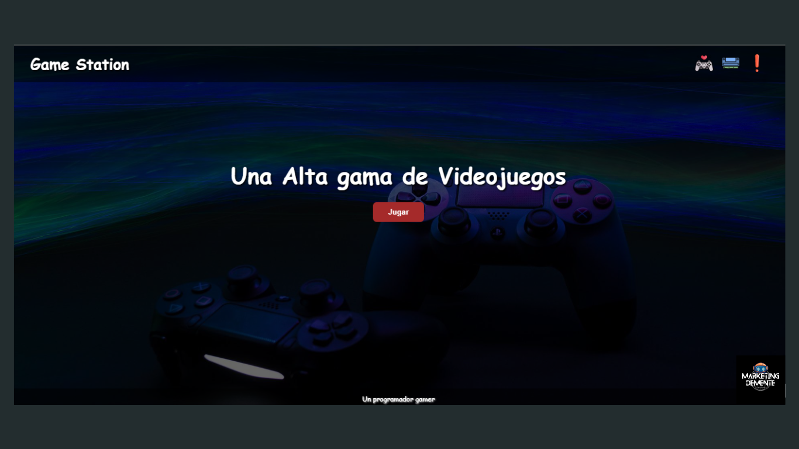

# Landing page project 2

Este es un proyecto de Landing Page básico, desarrollado solo con HTML y CSS, creado con el objetivo de practicar y mejorar mis habilidades de desarrollo web.

🌟 Características:
Diseño responsivo para adaptarse a diferentes tamaños de pantalla.
Uso de HTML y CSS para estructurar y estilizar la página.
Código limpio y fácil de entender, ideal para principiantes.
